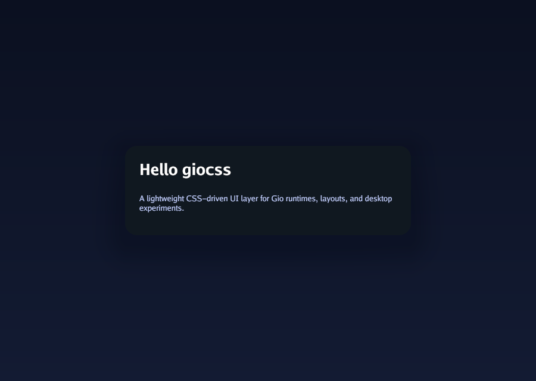

# giocss

giocss is a Go CSS engine extracted from Polyloft BVM.

It provides a lightweight HTML-like node model, stylesheet parsing and resolution, layout helpers, input normalization, and a Gio-based runtime/rendering layer for desktop UI experiments and host runtimes.



## Features

- StyleSheet creation, mutation, and CSS text parsing
- CSS canonical property mapping and value helpers
- HTML-like Node tree with style resolution helpers
- Layout reconciliation and intrinsic sizing helpers
- Gio window runtime and renderer integration
- Input normalization for text, number, date, time, and select flows
- Samples covering forms, navigation, tables, drawers, selectors, and docs views

## Install

```bash
go get github.com/ArubikU/giocss@latest
```

## Quick start

```go
package main

import (
	"image"

	"github.com/ArubikU/giocss"
)

func main() {
	ss := giocss.NewStyleSheet()
	ss.ParseCSSText(`
		.card { background: #101820; color: white; padding: 16px; }
	`)

	root := giocss.NewNode("div")
	root.AddClass("card")
	root.SetProp("text", "Hello giocss")

	runtime := giocss.NewWindowRuntime(
		giocss.WindowOptions{Title: "giocss", Width: 900, Height: 640},
		giocss.WindowRuntimeHooks{
			Snapshot: func(size image.Point) giocss.WindowRuntimeSnapshot {
				return giocss.WindowRuntimeSnapshot{
					RootLayout: giocss.LayoutNodeToNative(root, size.X, size.Y, ss),
					StyleSheet: ss,
					ScreenWidth: size.X,
					ScreenHeight: size.Y,
				}
			},
		},
	)

	defer runtime.Close()
	giocss.RunApp()
}
```

## Development

```bash
go test ./...
```

```bash
go run ./samples/cmd/generate-previews
```

## Docs

- Main module notes: docs/README.md
- Feature status: docs/FEATURES_STATUS.md
- Samples overview: samples/README.md

## Intended consumers

- Polyloft BVM runtime UI
- Experimental Gio-based desktop interfaces
- Future external Go render and layout adapters