# Samples

Each sample lives in its own folder and can be run independently with `go run ./samples/<sample-dir>`.

To regenerate all sample previews plus the root README preview:

```bash
go run ./samples/cmd/generate-previews
```

Every sample stores its screenshot as `preview.png` inside the same folder.

## Gallery

| 01 Hello World | 02 Buttons | 03 Login Form |
| --- | --- | --- |
| 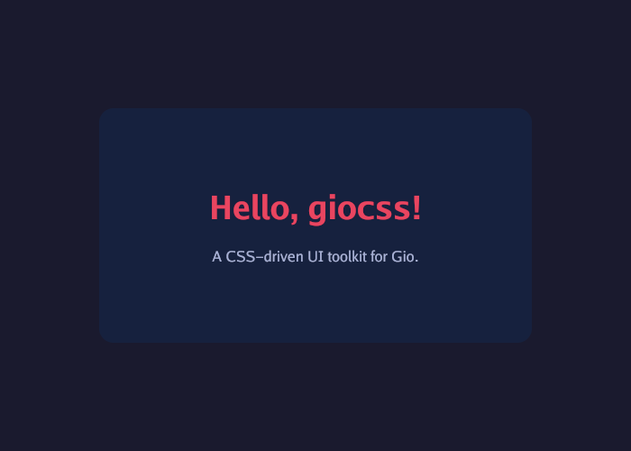 | 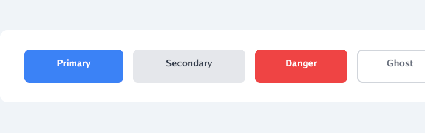 | 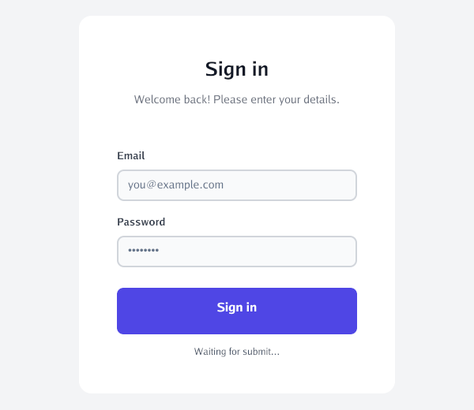 |
| 04 Cards | 05 Navigation | 06 Typography |
| 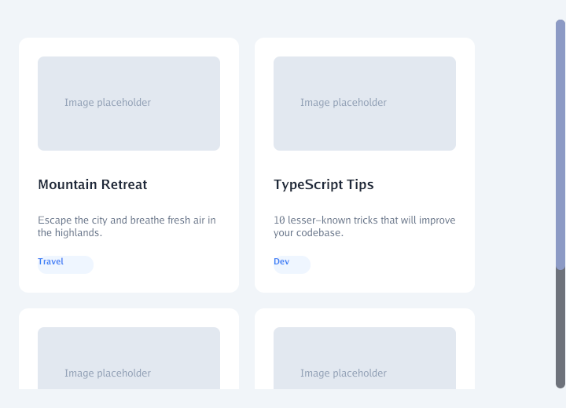 | 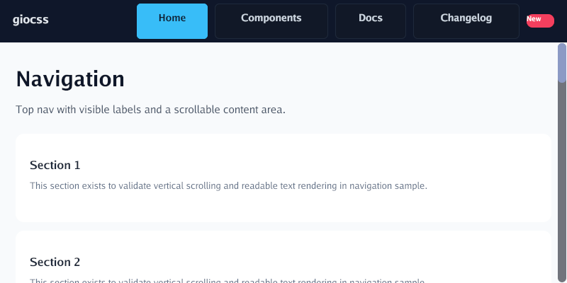 | 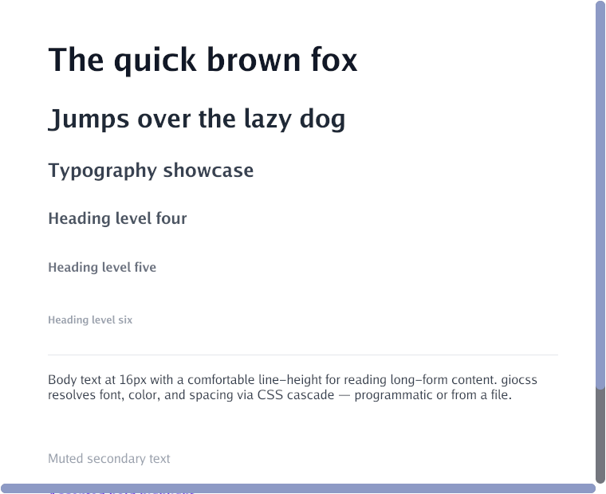 |
| 07 Color Swatches | 08 Todo List | 09 Dashboard |
| 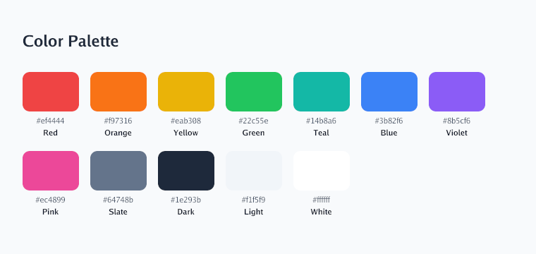 | 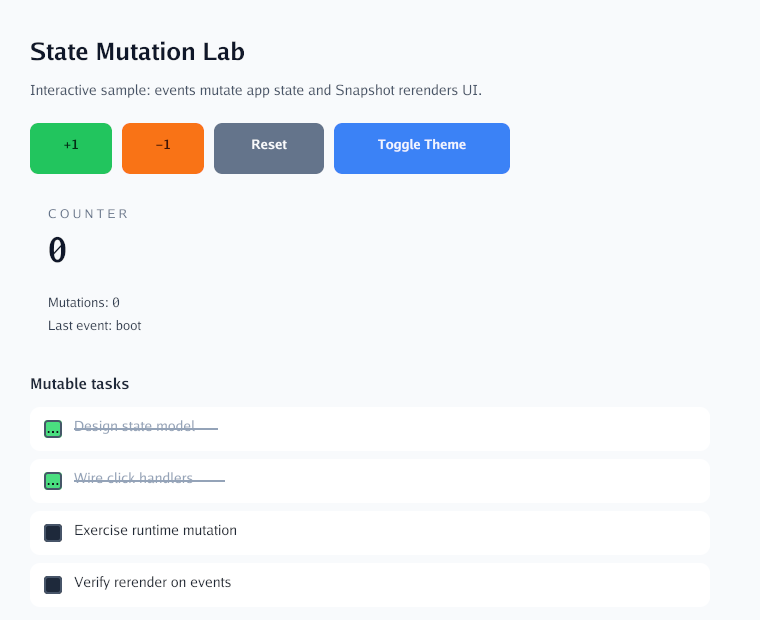 | 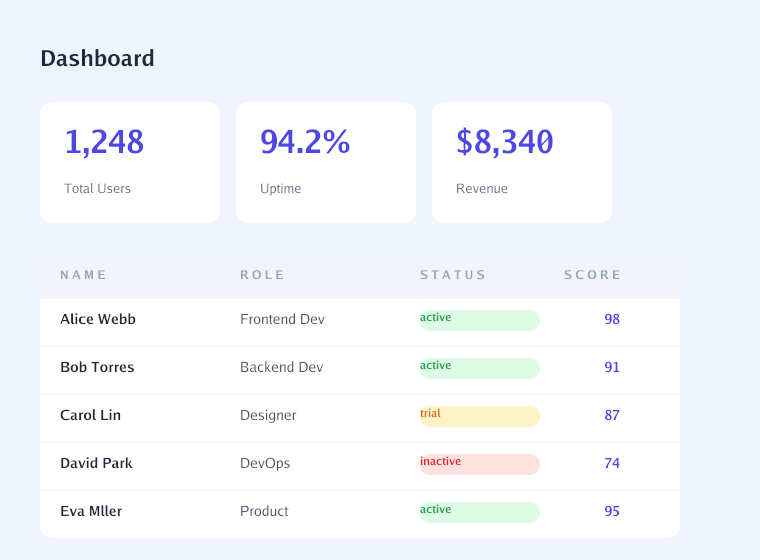 |
| 10 Dark Theme | 11 Modal | 12 Data Table |
| 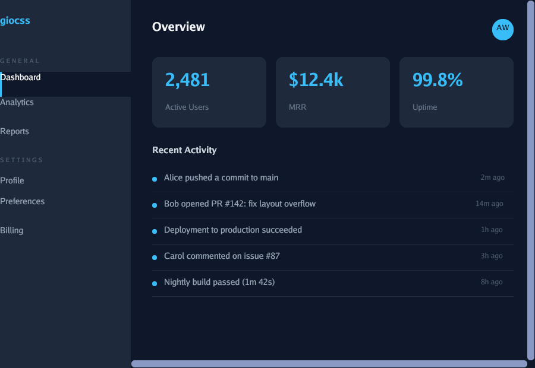 | 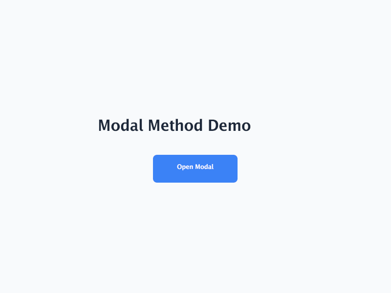 | 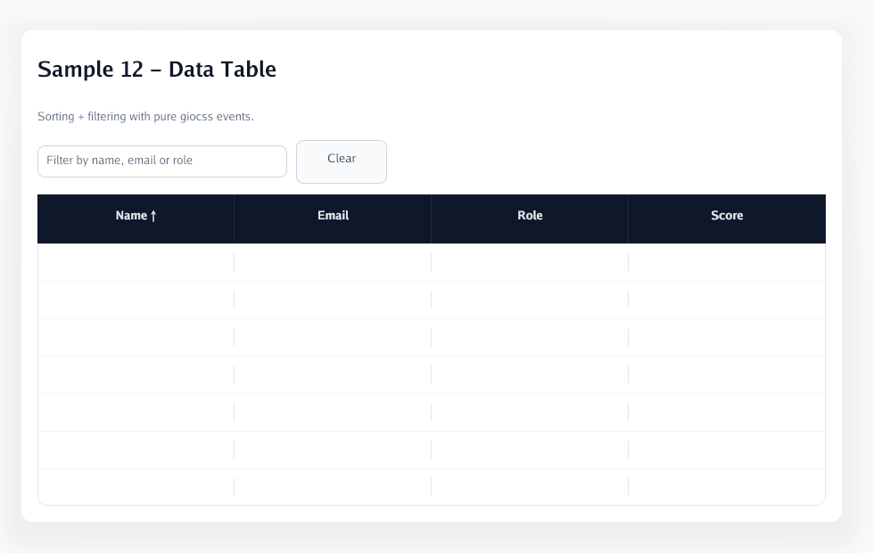 |
| 13 Tabs | 14 Accordion | 15 Notification Center |
| 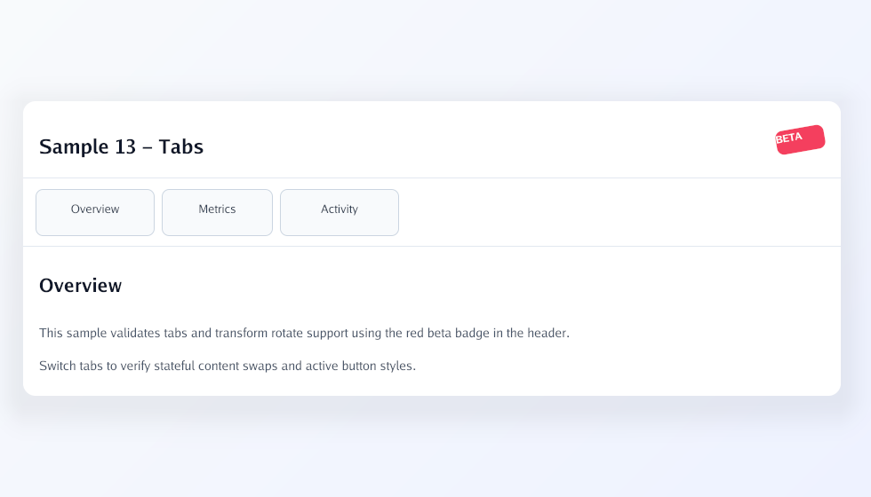 | 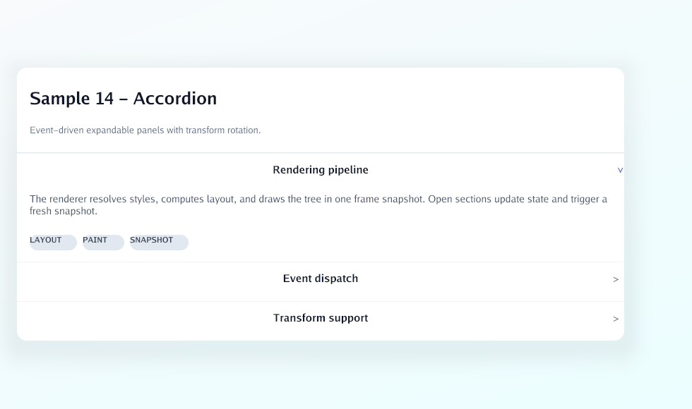 | 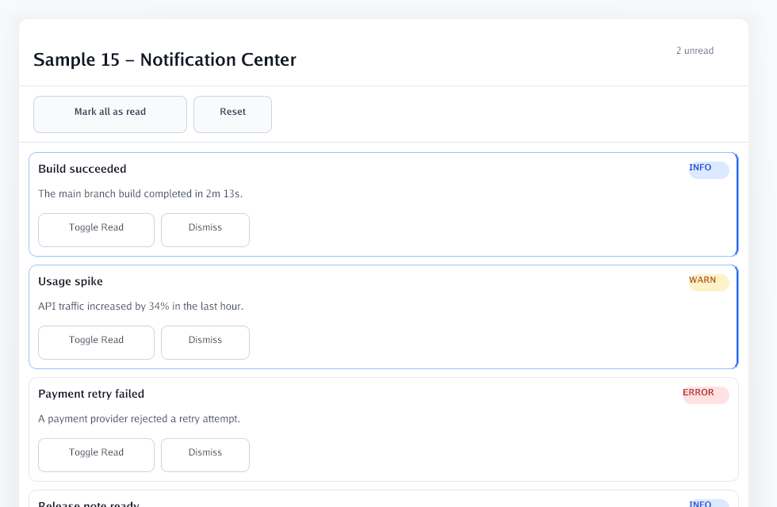 |
| 16 Side Drawer | 17 Search Autocomplete | 18 Docs Viewer |
| 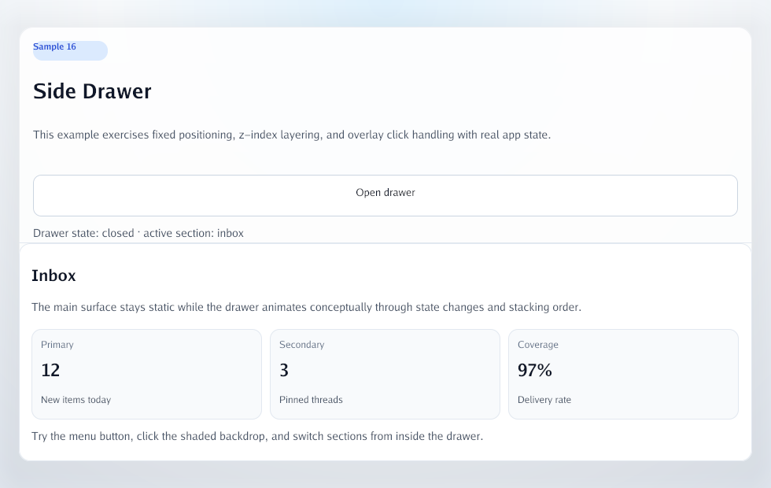 | 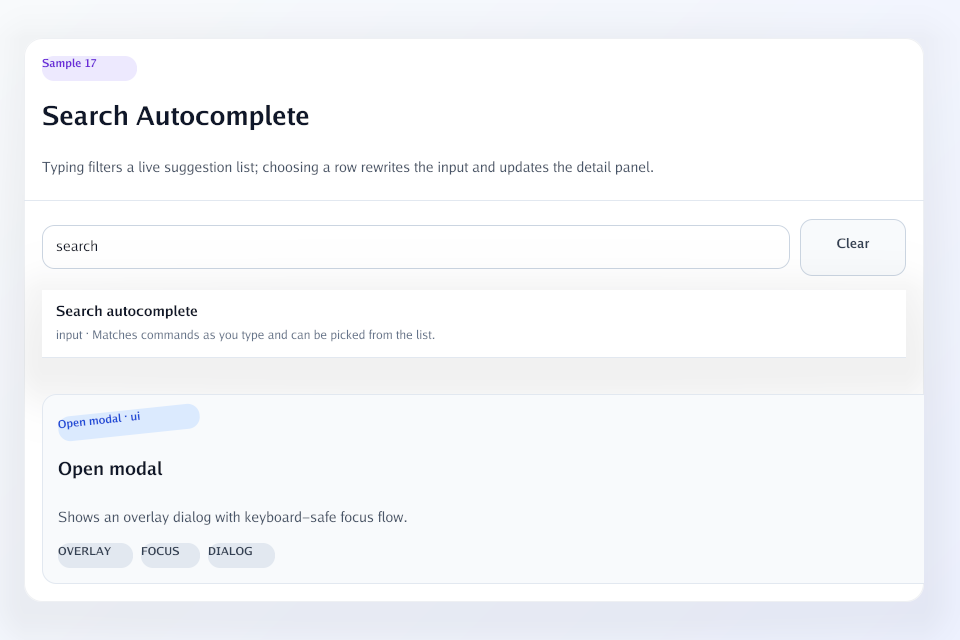 | 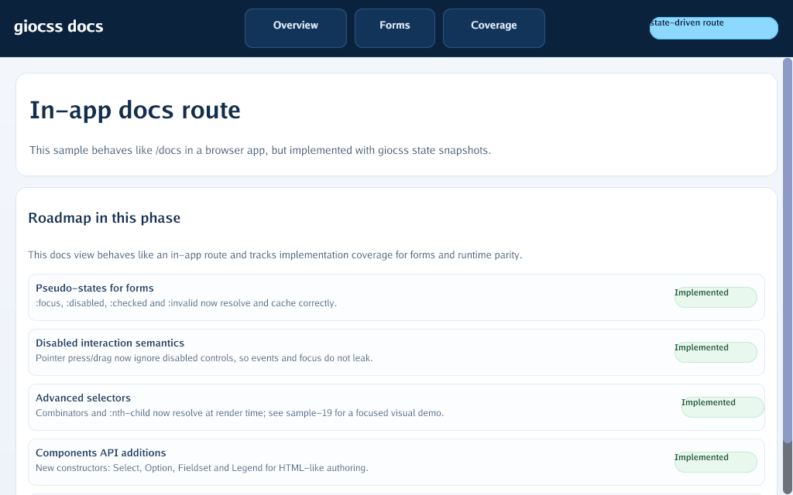 |
| 19 Advanced Selectors | 20 Form Rerender | 21 Transparent Todo Board |
| 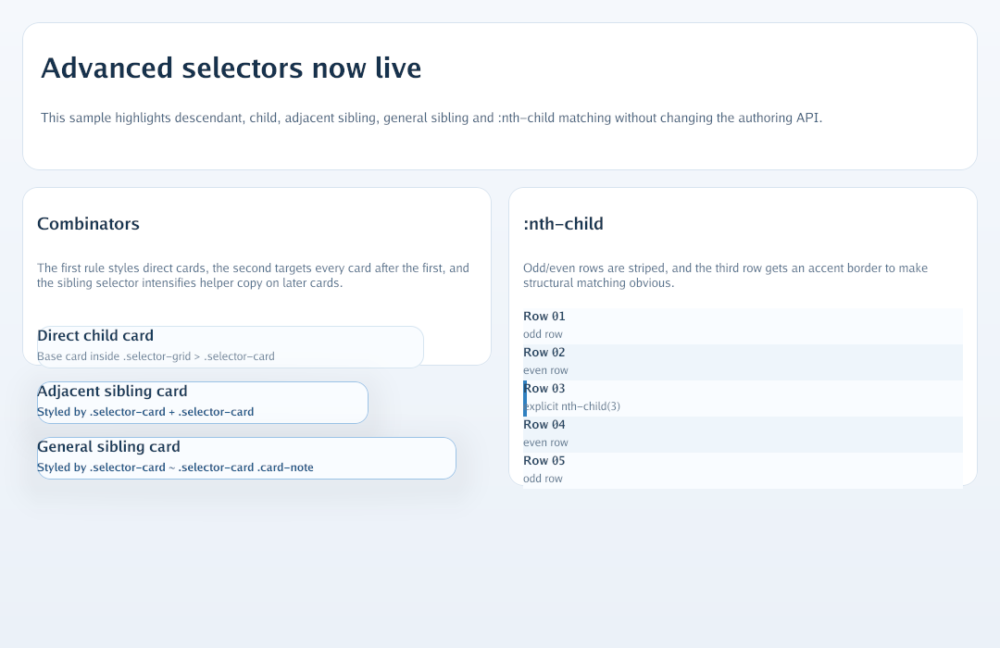 | 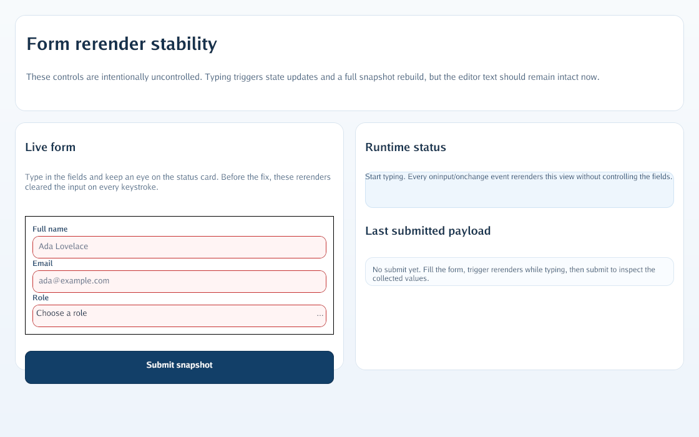 | 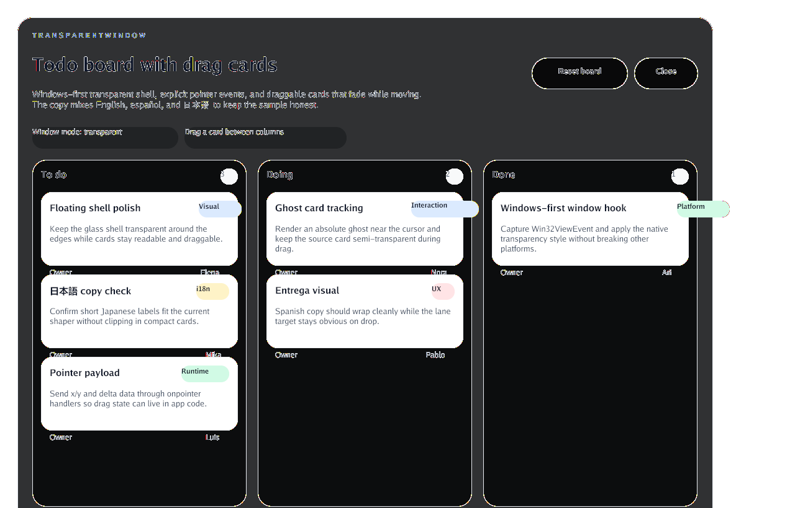 |

## Highlights

- `sample-12-data-table`: sorting and filtering in a dense data grid.
- `sample-13-tabs`: tab switching with transform rotation support.
- `sample-14-accordion`: expandable sections with rotated chevrons.
- `sample-15-notification-center`: read and dismiss flows for a live feed.
- `sample-16-side-drawer`: fixed drawer, overlay veil, and z-index layering.
- `sample-17-search-autocomplete`: input-driven suggestions and selection state.
- `sample-18-docs-viewer`: state-driven docs route with forms and coverage matrix.
- `sample-19-advanced-selectors`: descendant, child, sibling, and `:nth-child` selector coverage.
- `sample-20-form-rerender`: state-driven form that rerenders while typing without clearing uncontrolled inputs.
- `sample-21-transparent-todo-board`: transparent-window kanban board with drag card affordances.